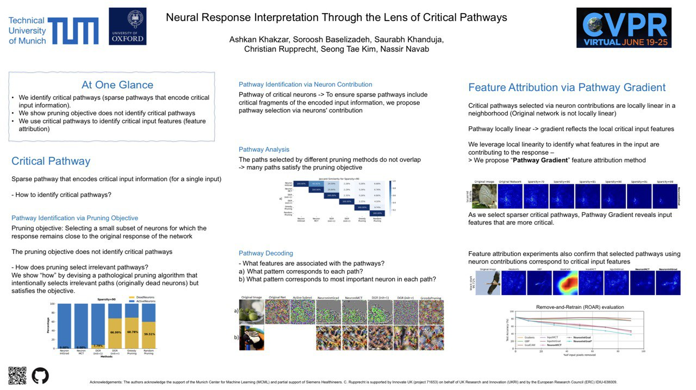
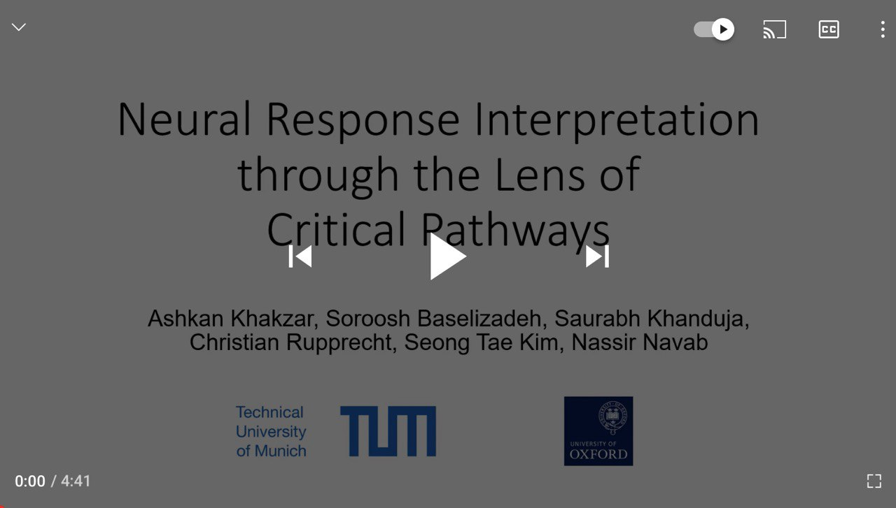

In this work, we: 
* discuss critical pathways (sparse neural pathways that encode critical input features), and show that the pruning obective does not identify these pathways
* propose a feature attribution (**saliency map**) method, "Pathway Gradient", by leveraging critical pathways


The paper is available on **[CVPR2021 Open Access](https://openaccess.thecvf.com/content/CVPR2021/html/Khakzar_Neural_Response_Interpretation_Through_the_Lens_of_Critical_Pathways_CVPR_2021_paper.html)** and on **[arXiv](https://arxiv.org/abs/2103.16886)**. 

View the [poster](Poster_Neural_Response_Interpretation_Through_the_Lens_of_Critical.pdf)
[](Poster_Neural_Response_Interpretation_Through_the_Lens_of_Critical.pdf)

Watch the [video on YouTube](https://youtu.be/z5uhcqtFORY)
[](https://youtu.be/z5uhcqtFORY)

Check the [Code on GitHub](https://github.com/CAMP-eXplain-AI/PathwayGrad.git)

#### Citation
Please cite the work using the below BibTeX (also available on the Open Access link above)
``` bash
@InProceedings{Khakzar_2021_CVPR,
   author    = {Khakzar, Ashkan and Baselizadeh, Soroosh and Khanduja, Saurabh and Rupprecht, Christian and Kim, Seong Tae and Navab, Nassir},
   title     = {Neural Response Interpretation Through the Lens of Critical Pathways},
   booktitle = {Proceedings of the IEEE/CVF Conference on Computer Vision and Pattern Recognition (CVPR)},
   month     = {June},
   year      = {2021},
   pages     = {13528-13538}
   }
``` 

or this one (available on arXiv):
``` bash
@article{Khakzar2021NeuralRI,
  title={Neural Response Interpretation through the Lens of Critical Pathways},
  author={Ashkan Khakzar and Soroosh Baselizadeh and Saurabh Khanduja and C. Rupprecht and Seong Tae Kim and N. Navab},
  journal={ArXiv},
  year={2021},
  volume={abs/2103.16886}
}
```


#### Contact
For inquiries please contact Ashkan Khakzar (ashkan.khakzar@tum.de). We would be happy to help.

